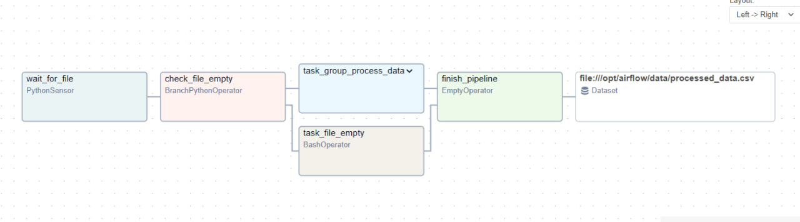
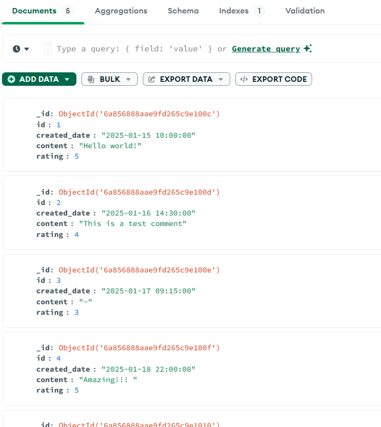
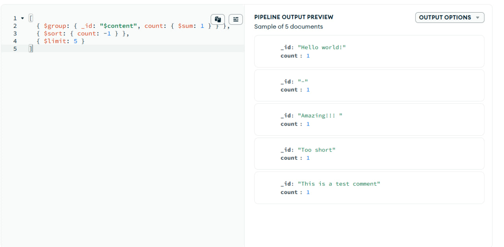
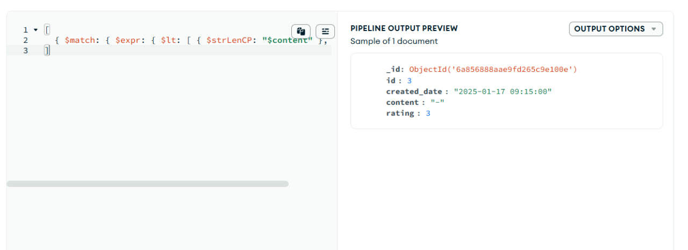
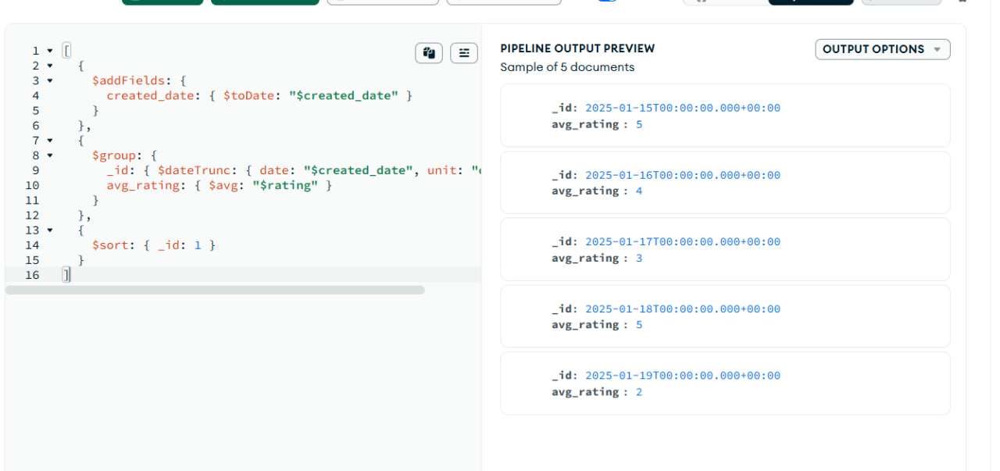

# Airflow ETL Pipeline with MongoDB

## Описание проекта
ETL-пайплайн на **Apache Airflow** для обработки CSV-файлов и загрузки данных в **MongoDB**.  
Пайплайн автоматически:
- Отслеживает появление новых файлов
- Проверяет файлы на пустоту
- Очищает и трансформирует данные
- Загружает результат в MongoDB

---

## 🛠 Стек технологий
| Инструмент | Назначение |
|------------|------------|
| Apache Airflow | Оркестрация задач |
| Docker | Контейнеризация |
| Python | Логика обработки |
| Pandas | Трансформация данных |
| MongoDB | Хранение данных |
| MongoDB Compass | Выполнение запросов |

---

## Структура проекта

my-airflow-pipeline/
├── dags/
│   ├── process_dag.py          # Основной DAG (обработка)
│   └── load_dag.py             # DAG для загрузки в MongoDB
├── data/
│   └── data.csv                # Входной файл
├── screenshots/                # Скриншоты для README
├── .gitignore                  # Игнорируемые файлы
├── docker-compose.yaml         # Конфигурация Docker
├── Dockerfile                  # Образ Airflow
├── requirements.txt            # Зависимости Python
└── README.md                   # Документация


## Запуск проекта

### 1. Запусти Docker-контейнеры
```bash
docker-compose up -d --build
```

### 2. Открой Airflow
- **URL:** `http://localhost:8080`
- **Логин:** `admin`
- **Пароль:** `admin`

### 3. Подготовь данные
Положи файл `data.csv` в папку `data/` со следующими колонками:
- `id` — идентификатор
- `created_date` — дата создания
- `content` — текст комментария
- `rating` — оценка (число)

### 4. Запусти пайплайн
В интерфейсе Airflow включи и запусти DAG `process_and_transform_dag`.

---

## Логика работы DAG

### DAG 1: `process_and_transform_dag`
1. **Сенсор** (`PythonSensor`) — ожидает появления файла `data.csv` в папке `data/`
2. **BranchOperator** — проверяет, пустой ли файл:
   - Пустой → логируется сообщение (`BashOperator`)
   - Не пустой → запускается `TaskGroup` с трансформациями
3. **TaskGroup** (3 задачи):
   - `replace_null` — замена `null` на `-`
   - `sort_by_date` — сортировка по `created_date`
   - `clean_content` — очистка поля `content` (удаление лишних символов)
4. **Финал** — создаётся файл `processed_data.csv`, который триггерит второй DAG

### DAG 2: `load_to_mongodb_dag`
- Автоматически запускается через **Dataset** при появлении `processed_data.csv`
- Загружает данные в MongoDB (база `airflow_db`, коллекция `processed_comments`)

---

## Результаты работы

### Скриншот DAG в Airflow


### Данные в MongoDB Compass


---

## 🔍 MongoDB Queries

### 1. Top 5 frequently occurring comments
```json
[
  { $group: { _id: "$content", count: { $sum: 1 } } },
  { $sort: { count: -1 } },
  { $limit: 5 }
]
```


---

### 2. All entries where content is less than 5 characters
```json
[
  { $match: { $expr: { $lt: [ { $strLenCP: "$content" }, 5 ] } } }
]
```


---

### 3. Average rating for each day
```json
[
  { $group: { _id: { $dateTrunc: { date: "$created_date", unit: "day" } }, avg_rating: { $avg: "$rating" } } },
  { $sort: { _id: 1 } }
]
```


---

## Автор
*Судникова Анастасия*  
[GitHub](https://github.com/AnastasiaSudnikova/BigDataTrainee)

---


